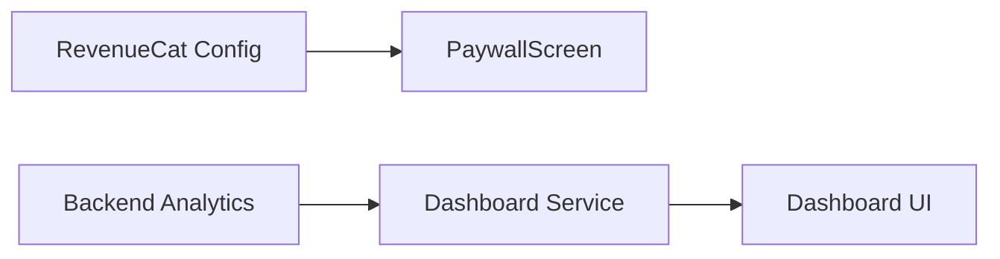
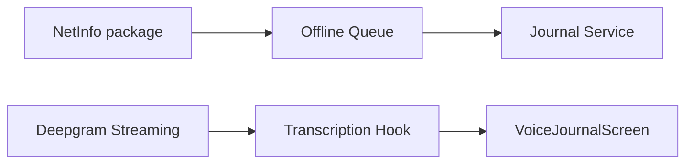

# Implementation Roadmap

**Created:** January 25, 2026  
**Target Launch:** 8 weeks from start  
**Status:** Ready to Execute

---

## Overview

This roadmap provides a week-by-week execution plan to complete all critical features identified in the gap analysis. Each sprint has clear deliverables and dependencies.

---

## Sprint Schedule

```
Week 1-2: Sprint 1 - Launch Blockers (Monetization + Analytics Display)
Week 3-4: Sprint 2 - Data Safety (Offline Support + Real-time Transcription)
Week 5-6: Sprint 3 - Differentiation (Recovery Phase + Notifications)
Week 7-8: Sprint 4 - Quality & Launch (Milestones + Analytics + Security)
```

---

## Sprint 1: Launch Blockers (Week 1-2)

### Goal
Enable monetization and demonstrate core value proposition through analytics.

### Deliverables

#### PRD 1: Paywall Purchase Flow
**Owner:** TBD  
**Effort:** 3-4 days

| Day | Task | Files |
|-----|------|-------|
| 1 | Connect PaywallScreen to useSubscription hook | `PaywallScreen.tsx` |
| 1 | Add loading/error states for purchase | `PaywallScreen.tsx` |
| 2 | Implement purchase button handlers | `PaywallScreen.tsx` |
| 2 | Add restore purchases flow | `PaywallScreen.tsx` |
| 3 | Add Firestore subscription sync | `RevenueCatProvider.tsx` |
| 3 | Test purchase flow on iOS simulator | - |
| 4 | Test on physical device with sandbox | - |
| 4 | Add feature gating to VoiceConversation | `VoiceConversationScreen.tsx` |

**Acceptance Test:**
- [ ] Can complete purchase with sandbox account
- [ ] Subscription appears in Firestore
- [ ] Non-subscribed users can't access gated features

#### PRD 3: Dashboard Analytics Integration
**Owner:** TBD  
**Effort:** 4-5 days

| Day | Task | Files |
|-----|------|-------|
| 1 | Create analytics types | `src/types/analytics.ts` |
| 1 | Create dashboard analytics service | `src/services/analytics/dashboardAnalytics.ts` |
| 2 | Create useDashboardAnalytics hook | `src/hooks/useDashboardAnalytics.ts` |
| 2 | Install chart library | `package.json` |
| 3 | Create MoodTrendChart component | `src/components/dashboard/MoodTrendChart.tsx` |
| 3 | Create InsightsSummary component | `src/components/dashboard/InsightsSummary.tsx` |
| 4 | Update DashboardScreen with new components | `DashboardScreen.tsx` |
| 4 | Add loading skeletons | `DashboardScreen.tsx` |
| 5 | Add time period selector | `DashboardScreen.tsx` |
| 5 | Test with various data scenarios | - |

**Acceptance Test:**
- [ ] Dashboard shows mood trend chart
- [ ] Insights summary displays topics
- [ ] Time period selector works
- [ ] Empty state shows "keep journaling" message

### Sprint 1 Dependencies


### Sprint 1 Risks
| Risk | Mitigation |
|------|------------|
| RevenueCat product setup incomplete | Verify products exist in RC dashboard first |
| Chart library compatibility | Test react-native-chart-kit before committing |

---

## Sprint 2: Data Safety (Week 3-4)

### Goal
Ensure users never lose data and deliver on real-time transcription promise.

### Deliverables

#### PRD 2: Offline Support & Error Recovery
**Owner:** TBD  
**Effort:** 5-6 days

| Day | Task | Files |
|-----|------|-------|
| 1 | Create offline queue service | `src/services/offline/offlineQueue.ts` |
| 1 | Create network monitor | `src/services/offline/networkMonitor.ts` |
| 2 | Create useOfflineSync hook | `src/hooks/useOfflineSync.ts` |
| 2 | Create SyncIndicator component | `src/components/common/SyncIndicator.tsx` |
| 3 | Modify VoiceJournalScreen to use queue | `VoiceJournalScreen.tsx` |
| 3 | Update journalService for pending entries | `journalService.ts` |
| 4 | Update JournalListScreen for pending display | `JournalListScreen.tsx` |
| 4 | Add sync indicator to HomeScreen | `HomeScreen.tsx` |
| 5 | Test offline recording | - |
| 5 | Test retry mechanism | - |
| 6 | Test app restart with pending | - |

**Acceptance Test:**
- [ ] Recording while offline saves locally
- [ ] Entry shows in list with "pending" badge
- [ ] Upload resumes when online
- [ ] Sync indicator shows pending count

#### PRD 4: Real-time Transcription UI
**Owner:** TBD  
**Effort:** 4-5 days

| Day | Task | Files |
|-----|------|-------|
| 1 | Create LiveTranscript component | `src/components/voice/LiveTranscript.tsx` |
| 2 | Create useRealtimeTranscription hook | `src/hooks/useRealtimeTranscription.ts` |
| 2 | Adapt deepgramStream for journaling | `src/services/voice/journalTranscriptionStream.ts` |
| 3 | Integrate into VoiceJournalScreen | `VoiceJournalScreen.tsx` |
| 3 | Connect audio stream to WebSocket | `VoiceJournalScreen.tsx` |
| 4 | Test interim vs final results | - |
| 4 | Test auto-scroll behavior | - |
| 5 | Test error handling and fallback | - |

**Acceptance Test:**
- [ ] Words appear within 2 seconds of speaking
- [ ] Interim text shows in lighter color
- [ ] Auto-scroll works, pauses when user scrolls up
- [ ] Final transcript saved with entry

### Sprint 2 Dependencies


---

## Sprint 3: Differentiation (Week 5-6)

### Goal
Implement recovery-specific features that make RecoverVoice unique.

### Deliverables

#### PRD 5: Recovery Phase Intelligence
**Owner:** TBD  
**Effort:** 4-5 days

| Day | Task | Files |
|-----|------|-------|
| 1 | Create recovery phase utilities | `src/utils/recoveryPhase.ts` |
| 1 | Create phase-specific prompts config | `src/config/recoveryPrompts.ts` |
| 2 | Create useRecoveryPhase hook | `src/hooks/useRecoveryPhase.ts` |
| 2 | Create RecoveryPhaseCard component | `src/components/home/RecoveryPhaseCard.tsx` |
| 3 | Update HomeScreen with phase display | `HomeScreen.tsx` |
| 3 | Update suggested prompts based on phase | `HomeScreen.tsx` |
| 4 | Update guided check-in questions | `VoiceJournalScreen.tsx` |
| 4 | Test phase transitions | - |
| 5 | Add phase transition celebrations | - |

**Acceptance Test:**
- [ ] HomeScreen shows "Week X, Day Y"
- [ ] Phase name and description displayed
- [ ] Prompts match current phase
- [ ] AI responses acknowledge phase

#### PRD 6: Notification System
**Owner:** TBD  
**Effort:** 3-4 days

| Day | Task | Files |
|-----|------|-------|
| 1 | Create notification service | `src/services/notifications/notificationService.ts` |
| 1 | Create useNotifications hook | `src/hooks/useNotifications.ts` |
| 2 | Add time picker to Settings | `SettingsScreen.tsx` |
| 2 | Store preferences in Firestore | `SettingsScreen.tsx` |
| 3 | Implement daily reminder scheduling | `notificationService.ts` |
| 3 | Add deep linking from notifications | `AppNavigator.tsx` |
| 4 | Test notification scheduling | - |
| 4 | Test streak warning logic | - |

**Acceptance Test:**
- [ ] Daily notification fires at set time
- [ ] Notification includes name and streak
- [ ] Tapping opens recording screen
- [ ] Time can be changed in settings

---

## Sprint 4: Quality & Launch (Week 7-8)

### Goal
Add measurement capabilities, polish, and prepare for launch.

### Deliverables

#### PRD 7: Analytics & Crash Reporting
**Owner:** TBD  
**Effort:** 2-3 days

| Day | Task | Files |
|-----|------|-------|
| 1 | Install Firebase Analytics & Crashlytics | `package.json`, config |
| 1 | Update analytics service | `analyticsService.ts` |
| 2 | Add tracking to key screens | Various screens |
| 2 | Add error boundary | `src/components/common/ErrorBoundary.tsx` |
| 3 | Test in Firebase console | - |

#### PRD 8: Milestone & Celebration System
**Owner:** TBD  
**Effort:** 3-4 days

| Day | Task | Files |
|-----|------|-------|
| 1 | Create milestone definitions | `src/config/milestones.ts` |
| 1 | Create milestone service | `src/services/milestones/milestoneService.ts` |
| 2 | Create useMilestones hook | `src/hooks/useMilestones.ts` |
| 2 | Update CelebrationScreen | `CelebrationScreen.tsx` |
| 3 | Add milestone check after entry save | `journalService.ts` |
| 3 | Create MilestonesBadges component | `src/components/dashboard/MilestonesBadges.tsx` |
| 4 | Add badges to Dashboard | `DashboardScreen.tsx` |

#### Launch Preparation
**Effort:** 3-4 days

| Day | Task |
|-----|------|
| 1 | Final security audit (PRD 10) |
| 1 | Type safety review (PRD 11) |
| 2 | Create App Store screenshots |
| 2 | Write App Store description |
| 3 | Create privacy policy page |
| 3 | TestFlight build |
| 4 | Beta testing |

---

## Daily Standup Template

```markdown
## Date: [DATE]

### Yesterday
- [ ] Completed: [task]
- [ ] Blocked: [issue]

### Today
- [ ] Working on: [task]
- [ ] Need: [help/review/decision]

### Blockers
- [List any blockers]
```

---

## Definition of Done

Each feature must meet these criteria before marking complete:

- [ ] Code reviewed
- [ ] TypeScript compiles without errors
- [ ] No console errors in dev mode
- [ ] Tested on iOS simulator
- [ ] Tested on physical device
- [ ] Dark mode verified
- [ ] Accessibility labels added
- [ ] Error states handled
- [ ] Loading states implemented
- [ ] Documentation updated (if needed)

---

## Risk Register

| Risk | Probability | Impact | Mitigation |
|------|-------------|--------|------------|
| RevenueCat sandbox issues | Medium | High | Test early, have fallback |
| Chart library performance | Low | Medium | Profile on low-end device |
| Deepgram streaming complexity | Medium | Medium | Keep batch as fallback |
| App Store rejection | Low | High | Follow guidelines strictly |
| Scope creep | High | Medium | Stick to PRDs, defer nice-to-haves |

---

## Communication Plan

### Weekly
- Sprint planning (Monday)
- Sprint review (Friday)

### Daily
- Async standup in Slack/Discord
- Blocker escalation within 4 hours

### As Needed
- PRD clarification
- Architecture decisions
- Bug triage

---

## Success Metrics (Post-Launch)

Track these within first 30 days:

| Metric | Target | How to Measure |
|--------|--------|----------------|
| Paywall conversion | >15% | Firebase Analytics |
| Day 2 return | >60% | Firebase Analytics |
| First entry completion | >60% | Firebase Analytics |
| Crash-free rate | >99% | Crashlytics |
| App Store rating | >4.5 | App Store Connect |

---

## Quick Reference

### Key Files to Modify

```
Sprint 1:
- src/screens/onboarding/PaywallScreen.tsx
- src/providers/RevenueCatProvider.tsx
- src/screens/dashboard/DashboardScreen.tsx
- src/hooks/useDashboardAnalytics.ts (new)

Sprint 2:
- src/services/offline/offlineQueue.ts (new)
- src/screens/voice/VoiceJournalScreen.tsx
- src/components/voice/LiveTranscript.tsx (new)
- src/hooks/useRealtimeTranscription.ts (new)

Sprint 3:
- src/utils/recoveryPhase.ts (new)
- src/screens/HomeScreen.tsx
- src/services/notifications/notificationService.ts (new)
- src/screens/settings/SettingsScreen.tsx

Sprint 4:
- src/services/analytics/analyticsService.ts
- src/config/milestones.ts (new)
- src/screens/voice/CelebrationScreen.tsx
```

### Commands

```bash
# Run app
npx expo start

# Run on iOS
npx expo start --ios

# Build for TestFlight
eas build --platform ios --profile preview

# Deploy functions
cd functions && npm run deploy
```

---

## Next Action

**Start Sprint 1 immediately with PRD 1: Paywall Purchase Flow**

First task: Open `src/screens/onboarding/PaywallScreen.tsx` and connect to `useSubscription` hook.
